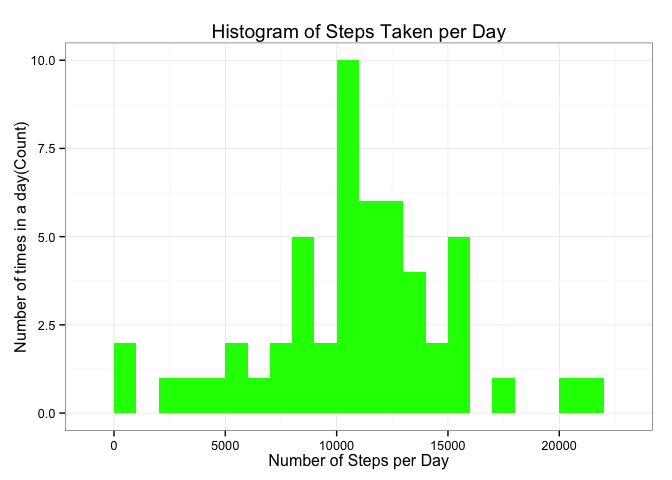
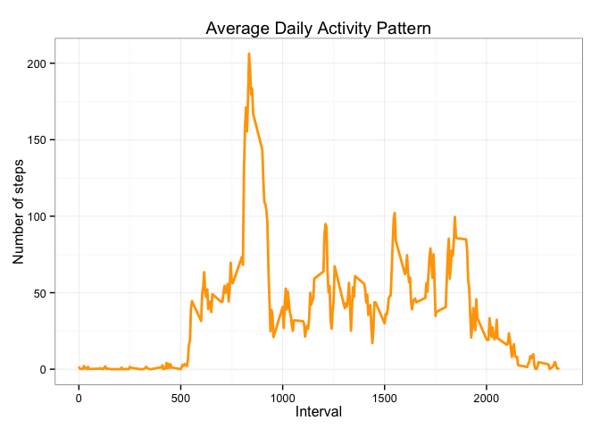
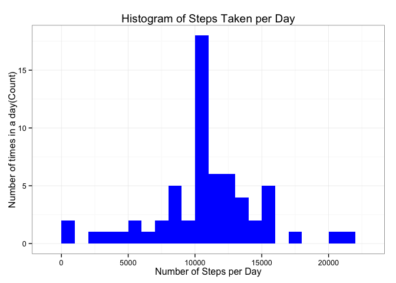
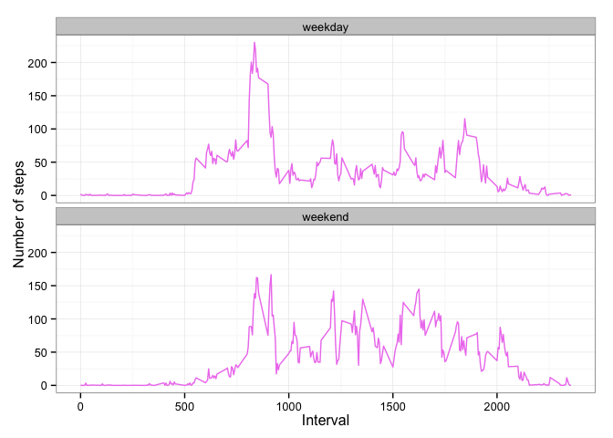

# Reproducible Research: Peer Assessment 1


## Loading and preprocessing the data

###### We are loading the neccessary libraries and preparing data processing in this step. As always there are a number options in R to perform tasks and ggplot2 is my chosen graphic device.


```r
library(knitr)
```

```
## Warning: package 'knitr' was built under R version 3.1.3
```

```r
opts_chunk$set(echo = TRUE, results = 'hold', smaller=TRUE)
library(data.table)
  library(ggplot2) # we shall use ggplot2 for plotting figures
```

```
## Warning: package 'ggplot2' was built under R version 3.1.3
```

```r
      MyData <- read.csv('activity.csv', header = TRUE, sep = ",",
                  colClasses=c("numeric", "character", "numeric"))

        MyData$date <- as.Date(MyData$date, format = "%Y-%m-%d")

        MyData$interval <- as.factor(MyData$interval)
```

## What is mean total number of steps taken per day?

###### We proceed by calculating the total steps per day and ignore missing values


```r
steps_per_day <- aggregate(steps ~ date, MyData, sum)
colnames(steps_per_day) <- c("date","steps")
head(steps_per_day)
str(MyData)
```

```
##         date steps
## 1 2012-10-02   126
## 2 2012-10-03 11352
## 3 2012-10-04 12116
## 4 2012-10-05 13294
## 5 2012-10-06 15420
## 6 2012-10-07 11015
## 'data.frame':	17568 obs. of  3 variables:
##  $ steps   : num  NA NA NA NA NA NA NA NA NA NA ...
##  $ date    : Date, format: "2012-10-01" "2012-10-01" ...
##  $ interval: Factor w/ 288 levels "0","5","10","15",..: 1 2 3 4 5 6 7 8 9 10 ...
```

###### We plot and calculate mean and median values


```r
ggplot(steps_per_day, aes(x = steps)) + 
       geom_histogram(fill = "green", binwidth = 1000) + 
        labs(title="Histogram of Steps Taken per Day", 
             x = "Number of Steps per Day", y = "Number of times in a day(Count)") + theme_bw()
```

 

```r
steps_mean   <- mean(steps_per_day$steps, na.rm=TRUE)
steps_median <- median(steps_per_day$steps, na.rm=TRUE)
```

###### The median number of steps per day is

```r
steps_mean   <- mean(steps_per_day$steps, na.rm=TRUE)
steps_median <- median(steps_per_day$steps, na.rm=TRUE)
steps_mean
steps_median
```

```
## [1] 10766.19
## [1] 10765
```
###### The mean number of steps per day is 10766.189 and the median number of steps is 10765.


## What is the average daily activity pattern?

######We will now calculate the aggregate steps by intervals of 5-minutes and convert the intervals as integers and save them in a data frame called steps_per_interval.


```r
steps_per_interval <- aggregate(MyData$steps, 
                                by = list(interval = MyData$interval),
                                FUN=mean, na.rm=TRUE)
#convert to integers
##this helps or makes plotting more efficient
steps_per_interval$interval <- 
        as.integer(levels(steps_per_interval$interval)[steps_per_interval$interval])
colnames(steps_per_interval) <- c("interval", "steps")
```
######We will plot with the time series of the average number of steps taken (averaged across all days) versus the 5-minute intervals:


```r
ggplot(steps_per_interval, aes(x=interval, y=steps)) +   
        geom_line(color="orange", size=1) +  
        labs(title="Average Daily Activity Pattern", x="Interval", y="Number of steps") +  
        theme_bw()
```

 


######Now, we find the 5-minute interval with the containing the maximum number of steps:


```r
max_interval <- steps_per_interval[which.max(  
        steps_per_interval$steps),]
max_interval
```

```
##     interval    steps
## 104      835 206.1698
```


######The 835th interval has maximum 206 steps.


## Imputing missing values

###Total number of missing values:

######The total number of missing values in steps can be calculated using is.na() method to check whether the value is mising or not and then summing the logical vector.

```r
missing_vals<-sum(is.na(MyData$steps))
```

######The total number of missing values are 2304.

###Strategy for filling in all of the missing values in the dataset

###### To allow for missing values, we choose to replace them with the mean value at the same interval across days. While the median is often perceived to be a better measure of centrality relative to the mean. In this example the total median is not much far away from total mean as we have used this value accordingly.

###### We developed a function na_fill(data, pervalue) which the data arguement is the MyData data frame and pervalue arguement is the steps_per_interval data frame.

```r
na_fill <- function(data, pervalue) {
        na_index <- which(is.na(data$steps))
        na_replace <- unlist(lapply(na_index, FUN=function(idx){
                interval = data[idx,]$interval
                pervalue[pervalue$interval == interval,]$steps
        }))
        fill_steps <- data$steps
        fill_steps[na_index] <- na_replace
        fill_steps
}

MyData_fill <- data.frame(  
        steps = na_fill(MyData, steps_per_interval),  
        date = MyData$date,  
        interval = MyData$interval)
str(MyData_fill)
```

```
## 'data.frame':	17568 obs. of  3 variables:
##  $ steps   : num  1.717 0.3396 0.1321 0.1509 0.0755 ...
##  $ date    : Date, format: "2012-10-01" "2012-10-01" ...
##  $ interval: Factor w/ 288 levels "0","5","10","15",..: 1 2 3 4 5 6 7 8 9 10 ...
```
######We check that are there any missing values remaining or not

```r
sum(is.na(MyData_fill$steps))
```

```
## [1] 0
```
######Zero output shows that there are NO MISSING VALUES.

###A histogram of the total number of steps taken each day

######We now plot a histogram of the daily total number of steps taken, plotted with a bin interval of 1000 steps, after filling missing values.

```r
fill_steps_per_day <- aggregate(steps ~ date, MyData_fill, sum)
colnames(fill_steps_per_day) <- c("date","steps")
```
######plotting the histogram


```r
ggplot(fill_steps_per_day, aes(x = steps)) + 
       geom_histogram(fill = "blue", binwidth = 1000) + 
        labs(title="Histogram of Steps Taken per Day", 
             x = "Number of Steps per Day", y = "Number of times in a day(Count)") + theme_bw() 
```

 
###Calculate and report the mean and median total number of steps taken per day.


```r
steps_mean_fill   <- mean(fill_steps_per_day$steps, na.rm=TRUE)
steps_median_fill <- median(fill_steps_per_day$steps, na.rm=TRUE)
steps_mean_fill   
steps_median_fill
```

```
## [1] 10766.19
## [1] 10766.19
```

######The mean is 10766.189 and median is 10766.189.

####Do these values differ from the estimates from the first part of the assignment?

######Yes, these values differ but the difference marginal. 
######Before filling the data Mean : 10766.189 Median: 10765
######After filling the data Mean : 10766.189 Median: 10766.189
######We see that the values after filling the data mean and median are equal.


####What is the impact of imputing missing data on the estimates of the total daily number of steps?


######We observe that while the mean value remains unchanged, the median value has shifted and virtual matches the mean. The net change is approx 1 step which is marginal.


## Are there differences in activity patterns between weekdays and weekends?


######We do this comparison with the table with filled-in missing values.
######1. Augment the table with a column that indicates the day of the week
######2. Subset the table into two parts - weekends (Saturday and Sunday) and weekdays (Monday through Friday).
######3. Tabulate the average steps per interval for each data set.
######4. Plot the two data sets side by side for comparison.

```r
weekdays_steps <- function(data) {
    weekdays_steps <- aggregate(data$steps, by=list(interval = data$interval),
                          FUN=mean, na.rm=T)
    # convert to integers for plotting
    weekdays_steps$interval <- 
            as.integer(levels(weekdays_steps$interval)[weekdays_steps$interval])
    colnames(weekdays_steps) <- c("interval", "steps")
    weekdays_steps
}

data_by_weekdays <- function(data) {
    data$weekday <- 
            as.factor(weekdays(data$date)) # weekdays
    weekend_data <- subset(data, weekday %in% c("Saturday","Sunday"))
    weekday_data <- subset(data, !weekday %in% c("Saturday","Sunday"))

    weekend_steps <- weekdays_steps(weekend_data)
    weekday_steps <- weekdays_steps(weekday_data)

    weekend_steps$dayofweek <- rep("weekend", nrow(weekend_steps))
    weekday_steps$dayofweek <- rep("weekday", nrow(weekday_steps))

    data_by_weekdays <- rbind(weekend_steps, weekday_steps)
    data_by_weekdays$dayofweek <- as.factor(data_by_weekdays$dayofweek)
    data_by_weekdays
}

data_weekdays <- data_by_weekdays(MyData_fill)
```


######Below we show the panel plot comparing the average number of steps taken per 5-minute interval across weekdays and weekends:


```r
ggplot(data_weekdays, aes(x=interval, y=steps)) + 
        geom_line(color="violet") + 
        facet_wrap(~ dayofweek, nrow=2, ncol=1) +
        labs(x="Interval", y="Number of steps") +
        theme_bw()
```

 

